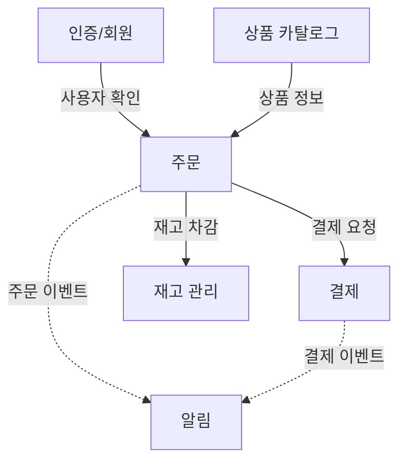
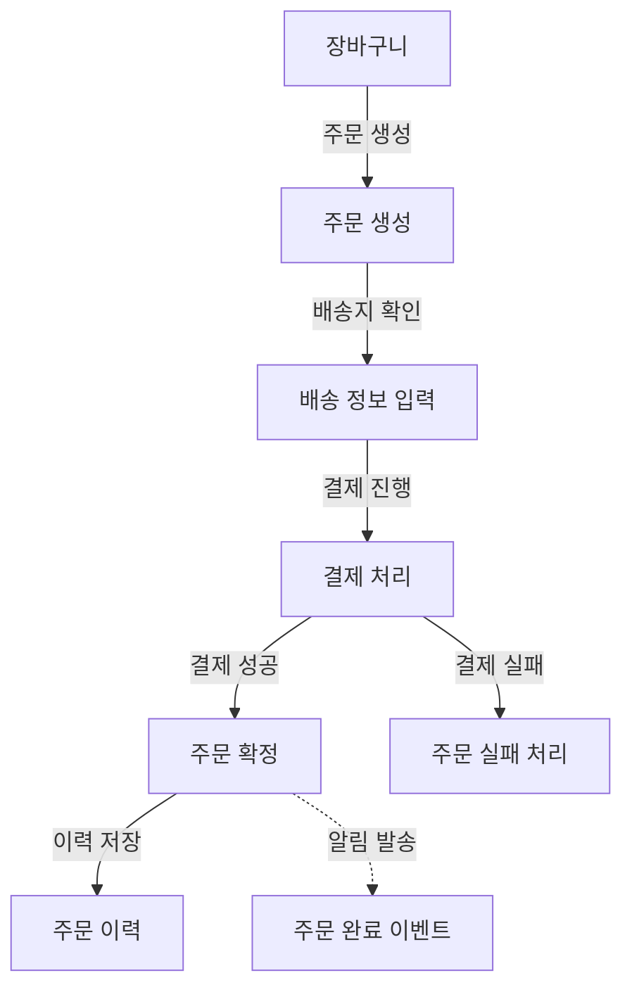
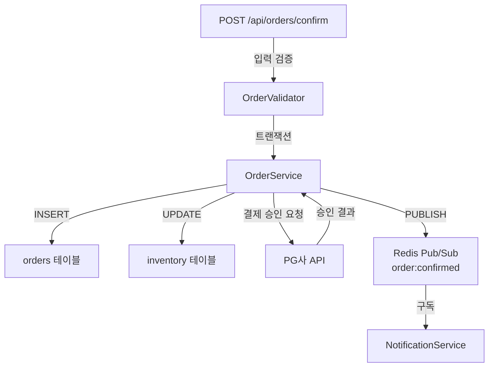

## 서론
Claude Opus 4.6이 출시 된 이후로 개인적으로 진행하는 모든 프로젝트에서 LLM에 대한 의존도가 크게 증가하였다. 어떤 프로젝트는 100% LLM에게 코딩을 시키고 있기도 하다. 요즘 트랜드도 전통적인 손코딩 방식에서 LLM을 이용 또는 의존 하는 방향으로 점차 이동하는 추세인 것 같다.  
또한 **바이브코딩**이라는 것이 뭔가 대단한 것이 아니라 **LLM을 이용해 자연어로 생각나는 대로 코딩**한다는 쉬운 접근성 덕분에 비전공자의 바이브코딩 후기글이 하루가 멀다하고 올라온다.  
덕분에 LLM을 이용하여 코딩하는 사람들을 위한 여러가지 방법이 제시되고 있다. 전통적으로 중요했던 TDD와 SDD부터 다시 수면 위로 떠오르게 된 DDD, 그 외에 CLAUDE.md의 사전 프롬프트 방법 등 모두 **프로젝트를 안정적으로 길게 유지할 수 있는 방법**으로써 좋은 방법들이다.  
그렇지만 위의 경우를 모두 지키다보면 어느순간 느껴지는게 있다. 바로 프로젝트는 올바른 방향으로 진행되고 있는 것 같지만 왠지 피로하다.  
필자 또한 모두가 그러하듯이 그것을 일찍이 느꼈다. LLM의 도움으로 하루에 20~30 커밋하는 것은 일도 아니지만 그것의 진행 방향을 신경쓰기 위해 자동으로 **배출**되는 작업 보고서 및 코드들은 하나하나 확인하기가 버겁다. 중요도가 낮은 어떤 프로젝트에선 프롬프트때문에 계속돼서 출력되지만 보지도 않는다.  
문제점을 느끼고 해결방법을 찾던 중 이번 글의 제목인 **Graph Driven Development** 에 대해 생각하게 되었고, 공유하고자 한다.  

<br/>

## 기존의 문제점  
기존의 방법은 다음과 같은 불편사항을 가지고 있다.  
1. 너무나도 많이 출력되는 문서들과 그것을 모두 읽어야 한다는 강박에서 오는 **스트레스와 피로감**
2. 실제로 문서를 모두 읽었음에도 프로젝트를 이해하지 못하는 **이해 부족**
3. LLM에게 자연어로 된 프롬프트를 전달하려고 하는데 실제로 내가 뭘 구현해야 하는지 모르겠고, 뭐라고 적어야 하는지 모르겠음  

이것을 타개할 방법으로 여러가지 편법을 시도해봤다. 문서의 콘텍스트를 줄여 핵심내용만 간략히한다던가, 내가 무엇을 위해 해당 프로젝트를 시작했는지 항상 상기한다던가, 극단적으로 모든 진행상황을 무시하고 오직 결과만 보기도 해봤다. 예상하겠지만 모두 프로젝트를 장기화 하기엔 결코 좋은 방법은 아니었고 큰 자괴감이 들었다. 그리고 가장 중요한 문제점은 결코 지워지지 않았다.

### 글은 눈에 잘 들어오지 않는다
프롬프트, 작업양에 따라 다르겠지만 작업 보고서를 작성할 만큼의 작업을 하고 LLM이 건내준 작업 보고서를 보면 내용은 좋다. 양식도 정해준대로 잘 만들어 준다. 하지만 한 문서당 200줄은 가볍게 넘는다. 좀 큰 작업을 하면 4~500줄을 넘길때도 자주 있다.  
출력되는 문서 양은 또 얼마나 많은가. 자동화를 해두지 않으면 매번 쏟아지는 문서를 정리해야 하고, 작업을 최신화 해야하고, 다시 LLM에게 명령을 내려야 한다. 어쩔때 보면 LLM이 나를 도와주는게 아니라 내가 LLM이 일을 잘할 수 있도록 도와주는 느낌도 든다.  
무엇보다 글은 선형적이다. 바이브코딩에서 가장 큰 문제중 하나라고 생각되는게 있는데 그것은 바로 **"지금 이 코드가 전체에서 어디에 있는지 모른다"** 라는 것이다. 내가 짠 코드가 아니니 당연히 모를 수 밖에 없다.  
결국 소프트웨어의 구조는 기능과 기능이 얽힌 구조인데, 이것을 장문의 글로 표현하니 구조가 흐릿해진다. 그렇다면 그래프로 표현하면 어떨까?

<br/>

## 그래프
<div style="display: flex; gap: 10px; align-items: flex-start;">
  <figure style="flex: 1; margin: 0;">
    
    <figcaption style="text-align: center; color: gray;">기존 문서들</figcaption>
  </figure>
  <figure style="flex: 1; margin: 0;">
    
    <figcaption style="text-align: center; color: gray;">그래프화 한 프로젝트 관계도 (by Mermaid)</figcaption>
  </figure>
</div>
<br/>

그림으로 보이는 것 처럼 그래프로 표현하면 프로젝트가 한눈에 보인다. 기능과 기능, 모듈과 모듈, 도메인과 도메인을 노드로 이어서 프로젝트를 관리하고 LLM에게 명령하는 것이 이번에 생각한 GDD의 핵심이다.  

<br/>

## 핵심 개념: 계층적 그래프

### 왜 단일 그래프가 아니라 계층(Layer)인가
하나의 그래프에 모든 걸 다 넣으면 노드가 30~50개만 되어도 복잡하여 읽을 수 없다. 위에 예시로 올린 이미지만 봐도 이미 복잡하다.  
계층으로 나눈다는 것은 같은 시스템을 **레이어별로 별도의 그래프 파일**로 관리한다는 뜻이다.

### Layer 0 - 도메인 그래프
시스템에 어떤 덩어리(도메인)들이 있고, 서로 어떻게 연결되는가만 보인다. 해당 그래프는 AI에게 전체 구조 파악 요청이나 비개발직군(기획, 디자인, 중요 결정권자 등)에게 전달하기 용이하다.



### Layer 1 - 기능 그래프
도메인 하나를 구체화한 것이다. 각 도메인 작업을 맡은 실무자에게 전달한다.  



### Layer 2 — 구현 그래프
기능 하나를 구체화해서 실제 API 엔드포인트, 클래스, 테이블이 보이는 계층이다. LLM에게 "주문 확정 API 코드 작성해"라고 할 때 이 파일을 준다.



**각 레이어의 노드 하나가 하위 레이어의 그래프 파일 하나에 대응한다.**

```
L0-system.mermaid
  └─ Order 노드 → L1-order.mermaid
                    └─ Confirm 노드 → L2-order-confirm.mermaid
```

### 계층의 핵심 원리
- 각 그래프 파일이 노드 5~10개 수준으로 작아서 한눈에 파악 가능
- LLM에게 "L0 + 관련 L1 + 해당 L2"만으로 명령 가능
- 새 기능 추가 시 해당 레이어에 노드 추가 + 하위 파일 생성으로 확장이 자연스러움

<br/>

## GDD Framework 제안
계층적 그래프라는 핵심 개념을 실제 프로젝트에 적용하려면, 원칙과 구조가 필요하다. <span style="color: gray;">(성숙하다고 말하기도 부끄러울 정도로 설계 극초기 단계이지만)</span> GDD Framework의 초기 설계를 소개한다.

### 핵심 원칙
**Graph as Truth** — 그래프에 없으면 존재하지 않는 것이다. 모든 기능, 의존성, 결정은 그래프에 반영된다.  
**Zoom In / Zoom Out** — 하나의 시스템을 여러 계층(Layer)으로 나누어 각 레이어에서 적절한 상세도를 유지한다.  
**Node = Context Boundary** — 각 노드는 AI나 개발자가 한 번에 다룰 수 있는 컨텍스트의 단위다.  
**Edge = Dependency Contract** — 노드 간 연결선은 단순한 화살표가 아니라 인터페이스 계약이다.  
**Graph First, Code Second** — 코드를 먼저 쓰지 않는다. 그래프에 노드를 추가한 후 코드를 작성한다.  

### 디렉토리 구조

```
my-project/
├── graph/
│   ├── L0-system.mermaid              # 시스템 전체 조감도
│   ├── L0-system.meta.yaml            # L0 노드 메타데이터
│   │
│   ├── auth/                          # 도메인별 하위 디렉토리
│   │   ├── L1-auth.mermaid
│   │   ├── L1-auth.meta.yaml
│   │   └── decisions/
│   │       └── DEC-auth-001.yaml
│   │
│   ├── order/
│   │   ├── L1-order.mermaid
│   │   ├── L1-order.meta.yaml
│   │   ├── L2-order-confirm.mermaid
│   │   ├── L2-order-confirm.meta.yaml
│   │   └── decisions/
│   │       ├── DEC-order-001.yaml
│   │       └── DEC-order-002.yaml
│   │
│   └── payment/
│       ├── L1-payment.mermaid
│       └── L1-payment.meta.yaml
│
├── src/
├── .gdd.yaml                          # GDD 설정
└── gdd-lock.yaml                      # 정합성 스냅샷 (자동 생성)
```

두 가지 설계 결정이 이 구조의 핵심이다.  
첫째, **그래프 파일과 메타 파일이 1:1 쌍으로 존재한다.** 각 `.mermaid` 파일과 같은 경로에 같은 이름의 `.meta.yaml`이 존재한다. Mermaid만으로는 담을 수 없는 노드별 상세 정보(담당자, 상태, API 명세, 소스 파일 경로 등)를 메타 파일이 보완한다. 예시는 다음과 같다.  

**L0 메타 파일 예시** — `graph/L0-system.meta.yaml`:
```yaml
graph: L0-system.mermaid
level: 0
description: "이커머스 플랫폼 전체 시스템 조감도"
last_updated: 2026-03-05

nodes:
  Order:
    child_graph: order/L1-order.mermaid
    owner: "@devman-kr"
    status: active
    description: "상품 주문 생성부터 확정까지의 전체 흐름"
    tech_stack: ["C#", "ASP.NET Core", "PostgreSQL", "Redis"]

  Auth:
    child_graph: auth/L1-auth.mermaid
    owner: "@devman-kr"
    status: active
    description: "JWT 기반 사용자 인증 및 회원 관리"
    tech_stack: ["C#", "ASP.NET Core Identity", "Redis"]

  Payment:
    child_graph: payment/L1-payment.mermaid
    owner: "@devman-kr"
    status: active
    description: "PG사 연동 결제 처리"
    tech_stack: ["C#", "ASP.NET Core", "PostgreSQL"]

  Catalog:
    child_graph: catalog/L1-catalog.mermaid
    owner: "@devman-kr"
    status: planned
    description: "상품 등록, 카테고리, 검색"

edges:
  - from: Order
    to: Auth
    type: requires
    contract: "JWT 토큰으로 사용자 식별"
  - from: Order
    to: Payment
    type: requires
    contract: "결제 승인 요청 API"
  - from: Order
    to: Inventory
    type: requires
    contract: "재고 차감 API"
  - from: Order
    to: Notification
    type: event
    contract: "order:confirmed 이벤트 발행"
```

**L1 메타 파일 예시** — `graph/order/L1-order.meta.yaml`:
``` yaml
graph: L1-order.mermaid
level: 1
parent_node: Order
parent_graph: ../L0-system.mermaid
description: "주문 도메인 내부 기능 흐름"
last_updated: 2026-03-05

nodes:
  Confirm:
    child_graph: L2-order-confirm.mermaid
    owner: "@devman-kr"
    status: active
    description: "결제 완료 후 주문을 최종 확정"
    api:
      method: POST
      path: /api/orders/confirm
      request: "{orderId, paymentToken}"
      response: "{orderId, status, confirmedAt}"

  OrderCreate:
    child_graph: L2-order-create.mermaid
    owner: "@devman-kr"
    status: active
    description: "장바구니 기반 신규 주문 생성"

edges:
  - from: Cart
    to: OrderCreate
    label: "주문 생성"
  - from: Confirm
    to: History
    type: requires
    contract: "주문 이력 저장 완료 후 orderId 반환"
```

**L2 메타 파일 예시** — `graph/order/L2-order-confirm.meta.yaml`:
```yaml
graph: L2-order-confirm.mermaid
level: 2
parent_node: Confirm
parent_graph: L1-order.mermaid
description: "주문 확정의 구현 상세"
last_updated: 2026-03-05

nodes:
  OrderValidator:
    owner: "@devman-kr"
    status: active
    source_file: "src/Order/Validators/OrderValidator.cs"
    description: "주문 확정 전 입력값과 비즈니스 규칙 검증"
    validations:
      - "주문 상태가 '결제 대기'인지 확인"
      - "요청 사용자가 주문자 본인인지 확인"
      - "재고가 충분한지 확인"

  OrderService:
    owner: "@devman-kr"
    status: active
    source_file: "src/Order/Services/OrderService.cs"
    description: "주문 확정 트랜잭션 실행"

decisions:
  - ref: DEC-order-001
  - ref: DEC-order-002
```
둘째, **도메인별 디렉토리로 분리한다.** 도메인이 10개가 되어도 각 디렉토리 안에는 3~6개 파일만 존재한다. 의사결정 기록(DEC 파일)도 도메인별 `decisions/` 폴더에 분산된다.  

**예시** — `graph/order/decisions/DEC-order-001.yaml`:
```yaml
id: DEC-order-001
title: "주문 확정 시 재고 차감 방식"
date: 2026-03-01
status: accepted
related_nodes:
  - graph: L2-order-confirm.mermaid
    node: OrderService

context: |
  인기 상품의 경우 동시에 여러 사용자가 같은 상품을 주문할 수 있다.
  재고 정합성과 주문 처리 속도 사이의 트레이드오프가 존재한다.

options:
  - name: "낙관적 동시성 (EF Core xmin 컬럼)"
    pros: ["높은 처리량", "락 대기 없음", "Npgsql 네이티브 지원"]
    cons: ["충돌 시 DbUpdateConcurrencyException 처리 필요", "재시도 로직 복잡"]
  - name: "비관적 락 (SELECT FOR UPDATE)"
    pros: ["충돌 방지 보장", "구현 단순"]
    cons: ["락 대기 발생", "데드락 가능성"]

decision: "비관적 락 (SELECT FOR UPDATE)"
reason: "인기 상품 주문 시 충돌 빈도가 높고, 재고 정합성이 최우선"

consequences:
  - "트랜잭션 타임아웃 설정 필요 (CommandTimeout = 3초)"
  - "데드락 감지 및 Polly 기반 자동 재시도 구현 (최대 3회)"
  - "재고 부족 시 사용자에게 즉시 안내 메시지 반환"
```

<br/>

## AI 컨텍스트 공급 전략
이 구조가 AI와 협업할 때 어떻게 쓰이는지가 GDD의 핵심 가치다. 

| 작업 유형      | AI에게 제공할 파일                |
|----------------|-----------------------------------|
| 전체 구조 파악 | L0 그래프 + L0 메타               |
| 기능 설계      | L0 + 해당 L1 + L1 메타            |
| 코드 구현      | L0 + L1 + L2 + L2 메타 + 관련 DEC |
| 버그 수정      | 해당 L2 + 연결된 L2들 + 메타      |
| 새 도메인 추가 | L0 + L0 메타 + 관련 DEC           |

작업의 범위에 따라 적절한 레이어의 파일만 골라서 넘기면 된다. AI의 컨텍스트 윈도우를 낭비 없이 쓸 수 있고, 동시에 AI가 "전체에서 이 부분이 어디에 있는지"를 항상 인식하게 된다.

<br/>

## GDD가 해결하려는 것

지금까지의 내용을 정리하면, GDD가 풀고자 하는 문제는 다음과 같다.  
> **AI가 전체 구조를 모른다** ─ L0 그래프로 한눈에 전달한다.  
**문서가 길면 AI가 앞부분을 잊는다** ─ 레이어별 분리로 필요한 컨텍스트만 제공한다.  
**"이거 바꾸면 어디가 깨지지?"** ─ 엣지가 영향 범위를 즉시 보여준다.  
**왜 이렇게 구현했는지 모른다** ─ `decisions/` 폴더가 노드별 의사결정 이력을 보존한다.  
**바이브코딩이 스파게티 코드로 이어진다** ─ Graph First 원칙과 동기화 강제로 구조를 유지한다.  

<br/>

## 마치며
이 글에서는 GDD가 왜 필요한지, 핵심 개념인 계층적 그래프가 무엇인지, 그리고 프레임워크의 기본 구조를 소개했다.  
하지만 솔직히 말하면, 아직까지는 아이디어에 불과하다. 실제로 프로젝트에 적용하면 여러 문제가 드러난다. 메타데이터 파일의 방대화, 그래프와 실제 코드의 동기화 오류 등 그 외에도 다양한 문제가 있을 것이라 생각한다. 또한 방법론(Development)이라는 거창한 말을 사용했지만 실제론 설계(Design/Architecture)방법에 더 가깝긴 하다.
그렇지만 현재 해당 방법론에 큰 애착이 가고, 꽤 괜찮은 아이디어라고 생각하는 만큼 개인적으로 진행중인 프로젝트에 적용하여 효과를 입증하는 것, 그리고 다양한 보조 방법으로 안정성을 높이는 것이 앞으로의 계획이다.  

<br/>

---

>**인사이트**  
**C4 Model** — 소프트웨어 아키텍처를 Context, Container, Component, Code 네 단계로 시스템을 분해하고, 다이어그램으로 시각화하는 방법.  
**Architecture Decision Records** — 소프트웨어 설계 과정에서 내린 중요한 기술적 결정과 그 배경·이유를 문서화한 기록  
**Graph Oriented Programming** — 데이터와 로직을 그래프 구조로 복잡한 관계와 흐름을 표현하는 접근법  
위 방법들이 핵심 개념을 수립하는데 많은 도움을 주었다.